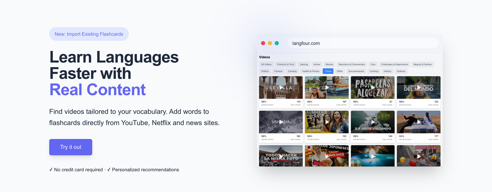
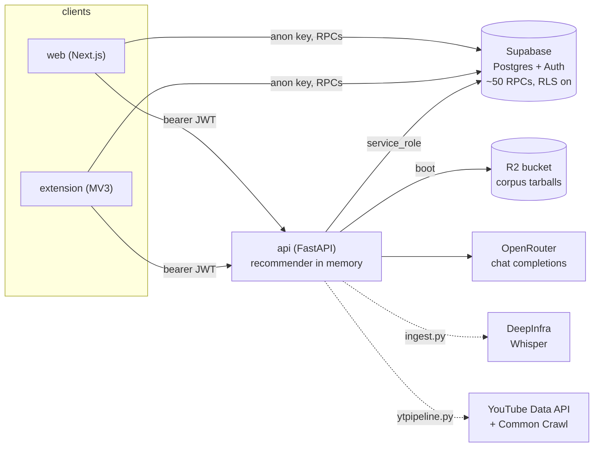

# Langfour

Langfour turns the content you already watch and read into personalized vocabulary practice.

Its Chrome extension translates unfamiliar words in place on YouTube, Netflix, Prime Video and any article page, saving them to a vocabulary collection. The web app turns that collection into spaced-repetition practice, and ranks 11,800 YouTube videos by how much of each one you can already understand.



[](https://github.com/victorfriedrich/langfour/actions/workflows/extension-ci.yml)

**Contents**

- [Why Langfour?](#why-langfour)
- [What it does](#what-it-does)
- [By the numbers](#by-the-numbers)
- [How it works](#how-it-works)
- [Five decisions worth defending](#five-decisions-worth-defending)
- [Running it locally](#running-it-locally)
- [Project status](#project-status)

Deeper reading: **[Architecture](docs/architecture.md)** · **[Configuration](docs/configuration.md)** · **[Database schema](apps/api/sql/supabase_schema.md)**

## Why Langfour?

Learners are stuck choosing between authentic content that is too hard and graded material that is not interesting. Research on extensive reading puts the sweet spot around 95% known words — but nothing tells you which video that is.

Langfour tracks your vocabulary as dictionary root forms rather than raw strings, highlights and translates unfamiliar words while you browse, scores 11,800 transcripts against what you know, and turns saved words into flashcards and example sentences.

## What it does

**Reader Mode** (`Cmd/Ctrl + Shift + Y`) rebuilds the current article with Mozilla Readability, highlights every word not yet in your vocabulary, and translates a word on click or a passage in context. **Subtitle integration** does the same inside YouTube, Netflix and Prime Video: unfamiliar words turn orange, hovering pauses playback and shows a translation, and words save without leaving the video.


**Recommendations** rank categorized videos by the share of their vocabulary you already know, showing how many new words each would teach. **Add Common Words** inverts the question: which words would unlock the most videos in a category if you learned them next?


**Practice** is a spaced-repetition session over the words due today, with a typing mode and a generated "words in context" exercise. Existing decks come in through **Anki import**, reading `.apkg` files straight from the bundled SQLite collection and matching words against the dictionary including inflections, so `hablaba` imports as `hablar`.

## By the numbers

| | |
|---|---|
| Transcript corpus | 11,798 videos, 2.3 GB raw, 137 MB shipped as gzipped tarballs |
| Dictionary | 179,353 root words across four languages, plus inflections |
| Vocabulary tracked | 316,802 user-word rows |
| Discovery queue | 13,434 videos selected out of a multi-million-channel crawl |
| Database | 11 tables, ~50 Postgres functions, RLS on every table |
| Tests | ~160 API cases, no network, about two seconds |

## How it works



Supabase owns user state and both clients reach it directly through RPCs under row-level security. The API owns everything needing the whole corpus in memory or a language model, so it alone holds the `service_role` key. A separate offline pipeline decides which YouTube videos are worth transcribing at all, and feeds them to workers through a queue.

Full walkthrough in **[docs/architecture.md](docs/architecture.md)**.

## Five decisions worth defending

**Recommendations are one matrix-vector product.** Each language is a binary CSR matrix with a row per transcript and a column per dictionary root, so scoring every video for a user is `D · known` followed by a division. Storing only the sparse form, after first holding both it and the Python lists, halved resident memory. → [details](docs/architecture.md#comprehension-ranked-recommendations)

**The backend refuses to boot with the wrong database key.** With RLS on, an `anon` key does not raise: PostgREST returns `[]` with HTTP 200, the dictionary cache loads empty, and every word silently becomes unknown. That shipped once, so the API now decodes its own key's `role` claim at import and exits unless it is `service_role`. → [details](docs/architecture.md#auth-and-the-two-supabase-keys)

**Auth denies by default.** It is a middleware rather than a per-route dependency, because the per-route version had left 15 of 22 endpoints open, including the ones that spend model credits and whose URL ships inside the extension bundle. A new route is protected unless someone adds it to a five-entry public list. → [details](docs/architecture.md#auth-and-the-two-supabase-keys)

**The corpus streams into the container.** Two gigabytes of transcripts belong in neither git nor an image, so they ship as one gzipped tarball per language and unpack at boot in 20 MB of peak RSS, against 130 MB for the obvious buffered version. Three details do that work, and the module docstring names them so nobody simplifies them away. → [details](docs/architecture.md#the-transcript-corpus)

**The discovery pipeline spends late.** Channel IDs come from range-requested Common Crawl indexes rather than the quota-metered YouTube API, every stage is resumable behind a durable marker, and the two stages that cost real money run only on channels that cleared every cheaper gate. Selection reads cached rows only, so re-tuning a threshold is free. → [details](docs/architecture.md#finding-videos-worth-transcribing)

## Running it locally

Requires Node.js 20+, Python 3.11+ with `venv`, a [Supabase](https://supabase.com) project and an [OpenRouter](https://openrouter.ai) key. `ffmpeg` is only needed to transcribe videos that have no subtitles.

```bash
git clone git@github.com:victorfriedrich/langfour.git
cd langfour
npm install
npm run api:install

cp apps/web/.env.sample       apps/web/.env
cp apps/extension/.env.sample apps/extension/.env
cp apps/api/.env.sample       apps/api/.env

npm run dev          # web on :3000, API on :8000
npm run api:test     # API tests
npm run build:ext    # writes apps/extension/dist, load it unpacked
```

Each app gets its own environment file because the three ship with different trust levels: everything in the web and extension files reaches users, and only the API file may hold a secret. What you need accounts for:

| Service | Needed for | What it costs |
|---|---|---|
| Supabase | everything | free tier |
| OpenRouter | API boot, translation, dictionary growth | fractions of a cent per transcript |
| DeepInfra | transcribing videos with no captions | $0.0002 per minute of audio |
| Cloudflare R2 | serving the corpus in production | free; egress is never billed |
| YouTube Data API | the discovery pipeline only | free, 10,000 units per day |

Only the first two are needed to run the app. Every variable, and where to find it, is in **[docs/configuration.md](docs/configuration.md)**.

> **On the name.** The product is Langfour everywhere it is user-visible, but internal identifiers keep an earlier `langfive` prefix: the `LANGFIVE_*` variables, the `langfive-corpus` bucket, the read-only IAM role and the image tag. Renaming them means changing the deployed environment, bucket and role in lockstep, so they are left alone deliberately.

## Project status

A working prototype I use daily — deployed and usable, not a polished product.

- **Browsers:** Chrome only (Manifest V3), distributed as a zip rather than through the Web Store.
- **Languages:** Spanish, German, Italian and French are supported in code, but the hosted app enables Spanish only, and the corpus is 10,650 Spanish videos out of 11,798. Anki import covers Spanish and Italian.
- **Recommendations:** ranked on unique-word coverage alone — not word frequency within a video, grammar or speaking speed.
- **Setup:** the database schema lives in the hosted Supabase project rather than as migrations here, so a from-scratch install needs it applied by hand. [`supabase_schema.md`](apps/api/sql/supabase_schema.md) is the inventory of what that means.
- **Tests:** heavy on the discovery pipeline, absent on the NLP layer and both clients. CI lints and type-checks the extension only.

Planned: export the schema as migrations; weight the recommender by in-video frequency and target ~5% new words rather than raw coverage; enable the other three languages once their corpora justify it; ship on the Chrome Web Store; add Firefox support; end-to-end extension tests against recorded pages.
