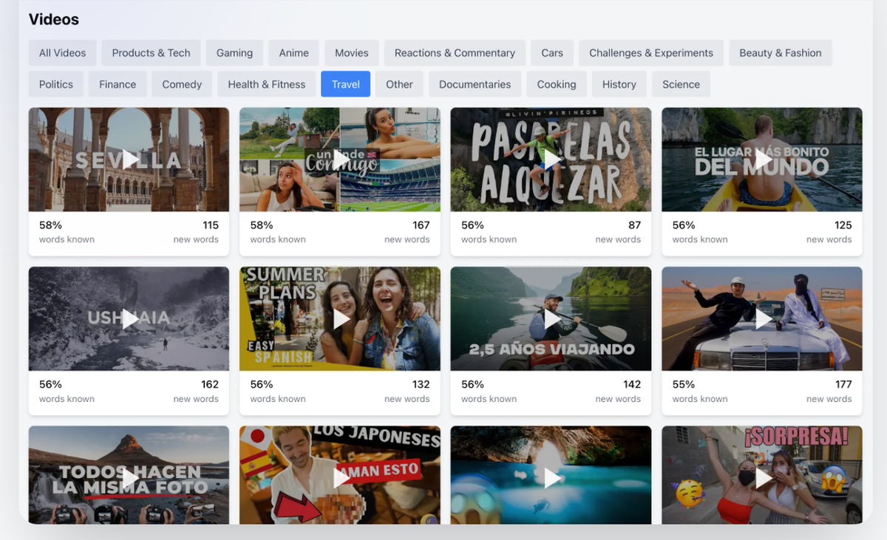
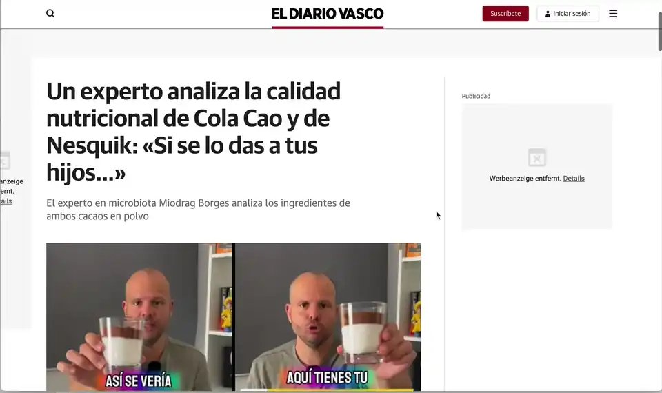
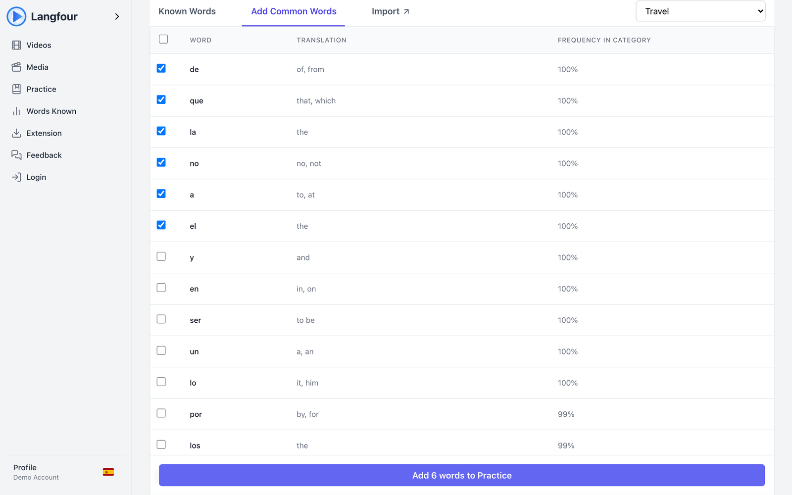
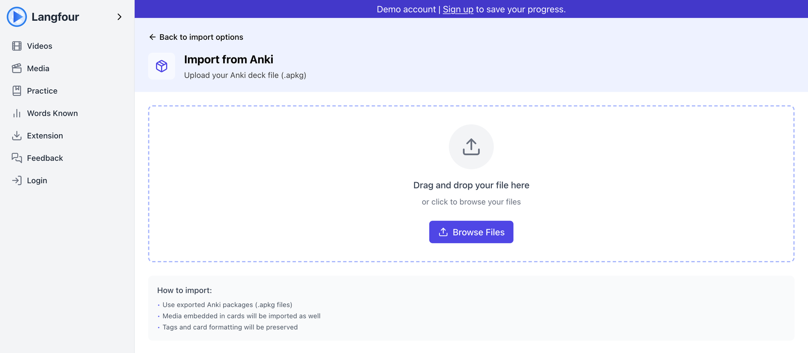

# Langfour

Langfour is a language-learning platform that turns the content you already consume into personalized vocabulary practice.

Its Chrome extension integrates with YouTube, Netflix, Prime Video and any article page, letting learners translate unfamiliar words in place, save them to a personal vocabulary collection, and discover videos that match their current level. The web app then turns that collection into spaced-repetition practice and vocabulary-aware video recommendations.

<!-- TODO: add a 30–60 s demo video link once recorded. -->



[](https://github.com/victorfriedrich/langfour/actions/workflows/extension-ci.yml)

## Why Langfour?

Language learners usually have to choose between authentic content that is too difficult and graded learning material that is not personally interesting. Research on extensive reading suggests the sweet spot is content where you already know roughly 95% of the words, but nothing tells you which video or article that is.

Langfour closes that gap by:

- Tracking which words you know, as a set of dictionary root forms rather than raw strings
- Highlighting unfamiliar words while you browse, and translating them in context
- Building a vocabulary collection from what you actually watched and read
- Scoring more than 11,000 YouTube transcripts against your vocabulary to recommend videos you can follow
- Turning saved words into flashcards, writing tests, example sentences and matching exercises

## Features

### Reader Mode

Press `Command + Shift + Y` (`Ctrl + Shift + Y` on Windows and Linux), or configure your own shortcut at `chrome://extensions/shortcuts`, to convert the current article into a focused reading view.

Reader Mode:

- Extracts the article body with Mozilla Readability and removes navigation, ads and comments
- Highlights every word that is not yet in your vocabulary
- Translates a word when you click it, and lets you add it to your collection in one click
- Translates any selected passage with a context-aware translation, not word by word



> **Current limitations:** Reader Mode works on any page Readability can parse, which covers most news sites and blogs but not paywalled or heavily scripted pages. Highlighting and translation support Spanish, German, Italian and French.

### YouTube Subtitle Integration

Langfour enhances the platform's own subtitles so learning from video does not interrupt watching.

- Unfamiliar words are highlighted in orange
- Hovering over a word pauses playback and shows its translation; moving away resumes it
- Words can be saved to your collection without leaving the video
- The same integration works on Netflix and Prime Video subtitles


The subtitle features were originally based on [Spotlight-Lingo](https://github.com/gevgeny/Spotlight-Lingo/) by Eugene Gluhotorenko and have since been rewritten around Langfour's vocabulary model.

> **Current limitations:** The video must have subtitles in the language you are learning; Langfour enhances the platform's captions rather than generating its own.

### Personalized Video Recommendations

The **Videos** page ranks a corpus of categorized YouTube videos by how much of their vocabulary you already know.

Each recommendation shows:

- The percentage of the video's words you already understand
- How many new words it would teach you
- How many of those new words are high-value, meaning they appear across many other videos

You can filter by category (Cooking, Science, Politics, Gaming and others), preview a video inline before committing to it, and videos you have already watched are excluded. The ranking blends "videos you understand best" with "videos that teach the most useful words".

### Vocabulary-Based Content Discovery

Under **Words Known**, Langfour lists the words you do not know yet, ordered by how many videos in your chosen category they appear in. Each word shows the share of the category it unlocks, so you can mark the ones you already recognise as known or add the rest to your collection with a shift-click range selection.

This is the recommender's own index read the other way round: instead of scoring videos by the words you already know, it scores words by how many videos they would unlock.



### Practice

The **Practice** page shows the words due today, with a streak counter, and offers three ways to review them.

#### Flashcards

A flashcard session over the words due today, scheduled with spaced repetition. Each answer updates the word's next review date in the database. A writing mode asks you to type the word instead of flipping the card.

Keyboard controls:

- `Space` — flip the card
- `Right Arrow` — mark as correct, or advance to the next card
- `Left Arrow` — mark as incorrect

#### Words in Context

For five words at a time, the backend generates short A1–A2 example sentences with the target words highlighted. After reading them you play a word-to-translation matching game over the same five words, and the result feeds back into the same spaced-repetition schedule as the flashcards.

### Progress

**Words Known** tracks your vocabulary size over time as a chart, lets you search, edit and remove saved words, and shows which categories of content your vocabulary already covers.

### Imported Media

The **Media** page lets you import your own episode transcripts (for a series you are watching, for example) as timestamped JSON. Imported transcripts are parsed into the same vocabulary model and become recommendable, so you can learn an episode's words before you watch it.

## Importing and Managing Vocabulary

Use **Words Known** to search, edit, organize and remove saved words. Use **Words Known → Import** to bring in an existing deck.

### Importing from Anki

Export your Anki deck as an **`.apkg` package**, or as **Notes in Plain Text (`.csv`, tab-separated, no header)**, then upload it from **Words Known → Import**. You can also paste tab-separated lines directly.

For best results, structure each record as:

| Field | Expected content |
|---|---|
| Front | Word or phrase in the language you are learning |
| Back | Translation in your native language |
| Extra fields | Ignored |

Import notes:

- `.apkg` files are read directly from the bundled SQLite collection, including the compressed `collection.anki21b` format used by recent Anki versions.
- HTML formatting, `[sound:...]` tags and media references are stripped from fields. RemNote exports, which store the card's folder path as nested lists, are reduced to the leaf item.
- Every word is matched against the dictionary, including inflected forms, so `hablaba` imports as `hablar`. Words that cannot be matched are shown separately and resolved with a language-model lookup before import.
- After upload you review the matched words and choose whether to import them as *learning* (they enter the practice schedule) or *known* (they only affect recommendations).
- Files are decoded as UTF-8 (with or without BOM) with a Latin-1 fallback.
- Anki import currently supports Spanish and Italian decks.



## Running Langfour Locally

### Prerequisites

- Node.js 20 or newer
- Python 3.11 or newer, with `venv`
- `ffmpeg` (only needed to transcribe videos that have no subtitles)
- A [Supabase](https://supabase.com) project and an [OpenRouter](https://openrouter.ai) API key

### Installation

```bash
git clone git@github.com:victorfriedrich/langfour.git
cd langfour
npm install
npm run api:install
```

Each app has its own environment file, because the three ship with different trust levels:

```bash
cp apps/web/.env.sample       apps/web/.env
cp apps/extension/.env.sample apps/extension/.env
cp apps/api/.env.sample       apps/api/.env
```

Fill in the Supabase URL and keys and the OpenRouter key; every sample documents each value and where to find it. Then start the web app and API together:

```bash
npm run dev          # web on http://localhost:3000, API on http://localhost:8000
```

Run the API tests with:

```bash
npm run api:test
```

> **A note on the name.** The product is Langfour everywhere it is user-visible. Internal identifiers still carry an earlier `langfive` prefix — the `LANGFIVE_*` environment variables, the `langfive-corpus` bucket, the `langfive-corpus-api-readonly` role and the `langfive-api` image tag. Those are load-bearing: renaming them means changing the deployed environment, the bucket and the IAM role in lockstep, which buys nothing. They are left alone deliberately.

> **Note:** the database schema currently lives in the hosted Supabase project and is not yet exported as migrations in this repository, so a from-scratch setup needs the schema applied by hand. The transcript corpus is likewise fetched from object storage; without `LANGFIVE_CORPUS_*` configured the recommender starts with whatever is in `apps/api/data/processed/`.

### Installing the Chrome Extension

```bash
npm run build:ext    # writes apps/extension/dist
```

1. Open `chrome://extensions`.
2. Enable **Developer mode**.
3. Select **Load unpacked**.
4. Choose `apps/extension/dist`.

Alternatively, download the prebuilt extension from the [live app](https://app.langfour.com/extension).

## Project Status

Langfour is a working prototype that I use daily. It is deployed and usable, but not yet a polished product.

### Current limitations

- **Browsers:** Chrome only (Manifest V3). The extension is distributed as a zip rather than through the Chrome Web Store.
- **Languages:** the codebase, dictionary and extension support Spanish, German, Italian and French, but the hosted app currently enables Spanish only. The corpus is heavily weighted towards Spanish (10,650 of 11,800 videos), so recommendations are richest there. Anki import supports Spanish and Italian.
- **Reader Mode:** any page Readability can parse; paywalled and app-like pages are not supported.
- **Subtitles:** the video needs subtitles in the target language. Auto-translated captions are not supported.
- **Recommendations:** ranked on unique-word coverage only; word frequency within a video, grammar and speaking speed are not considered yet.
- **Setup:** the database schema is not versioned in the repository.

### Planned improvements

- Export the Supabase schema and RPC functions as migrations so the project can be set up from scratch
- Weight the recommender by in-video word frequency and add a "5% new words" target instead of a raw comprehension ranking
- Enable German, French and Italian in the hosted app once their corpora are large enough for useful recommendations
- Publish the extension on the Chrome Web Store
- Add Firefox support once the extension's few Chrome-specific calls are abstracted
- End-to-end tests for the extension against recorded YouTube pages

## What I Learned

**Silent failures are worse than crashes.** The most expensive bug in this project was a backend deployed with the wrong database key after row-level security was enabled. Nothing errored: every query returned an empty list with HTTP 200, and the app quietly treated all words as unknown. The fix was not a better test but a boot-time check that inspects the key's own role claim and refuses to start, plus a rule that an empty dictionary cache is never legitimate. I now treat "what does this look like when it fails silently?" as a design question.

**Memory is a first-class constraint on small hosts.** The first recommender held both the Python list-of-lists corpus and the sparse matrix, nearly doubling memory, and the first corpus loader read a 118 MB archive into RAM before extracting it. Profiling with `tracemalloc` and switching to CSR-only storage and streaming tar extraction brought the API well under the limits of a small container, and taught me to measure peak RSS rather than assume.

**One source of truth for identifiers.** Languages were represented as ISO codes in some places and English names in others, across six independent mapping tables. Two of them were missing French, so French learners were silently served Spanish vocabulary. Collapsing them into a single `languages` module in each app, with conversion only at the boundary and `None` instead of a default on unknown input, removed a whole class of bugs. In a production version I would also generate shared TypeScript types from the database schema so the extension, web app and API could not drift.
