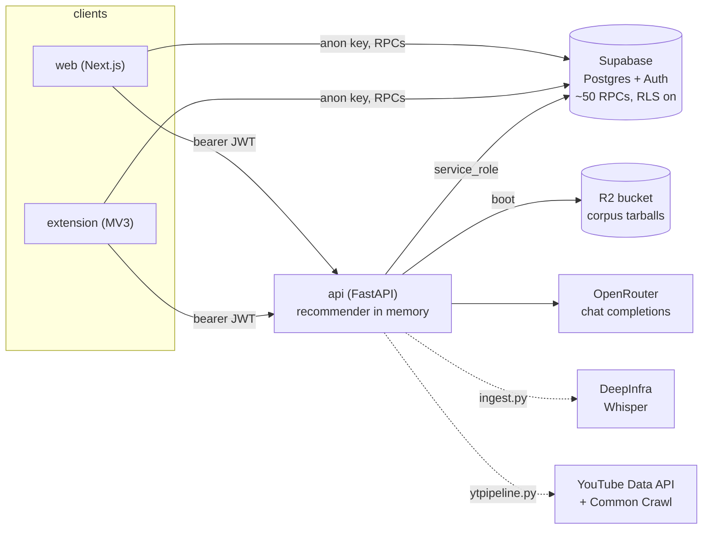
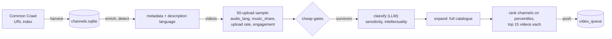

# Architecture

How Langfour is put together and why. For setup and environment variables see
[configuration.md](configuration.md); for the database, see
[`apps/api/sql/supabase_schema.md`](../apps/api/sql/supabase_schema.md).

**Contents**

- [Layout](#layout)
- [Comprehension-ranked recommendations](#comprehension-ranked-recommendations)
- [From text to dictionary IDs](#from-text-to-dictionary-ids)
- [Auth and the two Supabase keys](#auth-and-the-two-supabase-keys)
- [LLM layer](#llm-layer)
- [The Chrome extension](#the-chrome-extension)
- [Finding videos worth transcribing](#finding-videos-worth-transcribing)
- [Ingestion queue](#ingestion-queue)
- [The transcript corpus](#the-transcript-corpus)
- [Tests](#tests)
- [Deployment](#deployment)

## Layout

```
langfour/
├── apps/
│   ├── web/          Next.js 16 app            (npm workspace: lang-frontend)
│   ├── extension/    Chrome extension, MV3     (npm workspace: spotlight-lingo)
│   └── api/          FastAPI + NLP             (Python 3.11)
│       ├── app.py            routes, middleware, startup
│       ├── recommender.py    document-term matrix, ranking
│       ├── nlp_processing.py text -> dictionary IDs, LLM-backed dictionary growth
│       ├── auth.py           deny-by-default bearer-token middleware
│       ├── llm_client.py     the only place an LLM client is built
│       ├── ytpipeline.py     channel discovery -> selection -> video_queue
│       ├── ingest.py         drains video_queue into transcripts
│       ├── corpus_sync.py    streams the corpus from object storage at boot
│       ├── paths.py          all filesystem locations
│       ├── sql/              schema inventory and runbook SQL
│       └── data/             corpus + reference datasets
└── package.json      npm workspaces + the dev entrypoints
```



**Supabase** owns user state: known words, flashcards, the spaced-repetition
schedule, seen videos. Both clients talk to it directly through RPCs under
row-level security, and the SM-2 update itself is a Postgres function rather
than client code.

**The API** owns everything that needs the whole corpus in memory or an LLM:
video and word recommendations, parsing text into dictionary IDs, translation.
It reads and writes on behalf of every user, so it alone holds the
`service_role` key.

The schema and its ~50 functions are managed in the Supabase dashboard, not as
migrations here. The database is the source of truth; `apps/api/sql/` holds a
generated inventory of it and the runbook SQL that was applied by hand.

## Comprehension-ranked recommendations

`recommender.py` holds one binary **document-term matrix per language**: a
SciPy CSR matrix with a row per transcript and a column per dictionary root ID,
`1` where the word occurs. Only the sparse form is kept after startup; holding
the Python lists alongside it doubled resident memory.

Ranking videos for a user is one sparse matrix-vector product:

```
known    = 0/1 vector over dictionary IDs, from the user's userwords
per_doc  = D · known                       # known words in each transcript
ratio    = per_doc / D.sum(axis=1)         # fraction the user would understand
```

Then filter (seen videos, category, fewer than 100 distinct words), sort by
ratio, and open the JSON metadata only for the top candidates. The word
recommendations are the same matrix read the other way: column sums give how
many transcripts each word appears in, known columns are zeroed, and the
highest remaining counts are the words that unlock the most content
(`improvement = docs containing it / total docs`). A blended endpoint
(`/recommendations/videos/custom`) trades off "videos I mostly understand"
against "videos dense in the words I am targeting" with a single λ.

The matrix is cached as `document_term_matrix.npz` next to the transcripts,
with a manifest of filenames and the max word ID. It is rebuilt when the file
list or the largest ID changes, or when `blacklist.txt` (420 hand-curated
exclusions) is newer than the cache. Startup logs the resident matrix size,
which is the number that sizes the container.

## From text to dictionary IDs

Everything downstream keys on integer **root IDs**, not surface strings, so
"hablo", "hablas" and "hablé" all count as one known word. The dictionary is the
`words` and `wordforms` tables, loaded into an in-memory cache at boot
(`database.py`), and it grows itself:

1. `group_text` splits text into word and non-word runs.
2. `parse` resolves each word against the cache. Anything missing is collected.
3. Missing words go through **one** batched LLM call (`verify_language`) that
   rejects names, foreign words and noise.
4. Each survivor is lemmatised (`get_word_root`), given its inflections
   (`generate_alternatives`), verified once more with structured output
   (`verify_and_translate`), and written to Supabase with a translation. A form
   the verifier rejects is stored **flagged** rather than dropped, so the same
   token is not re-derived on every request but also never resolves to a root
   we decided was wrong.

The boot check in `database.py` refuses to serve on an empty cache. An empty
dictionary is never legitimate, and it is exactly what an `anon` key under RLS
produces (see the next section).

## Auth and the two Supabase keys

| Key | Held by | Ships to users? | Bypasses RLS? |
|---|---|---|---|
| `anon` | web, extension | yes | no |
| `service_role` | api | no | **yes** |

RLS is on for every table in `public`. The clients read and write only their
own rows through RPCs; the API reads everyone's rows with `service_role`.

Three decisions in `auth.py` and `supabase_client.py` are worth knowing:

- **Deny by default.** API auth is a Starlette middleware, not a per-route
  dependency. The previous per-route approach left 15 of 22 endpoints
  unprotected, including translation endpoints that spend LLM credits and whose
  URL ships inside the extension bundle. A new route is now protected unless
  it is added to a five-entry `PUBLIC_PATHS` set.
- **Token verification is cached** for 120 s, keyed by the JWT itself, because
  `auth.get_user` is a network round trip to GoTrue and the API's availability
  should not depend on it per request. The TTL is well under the 3600 s token
  lifetime so revocation still bites quickly. The cache is dropped wholesale
  at 10,000 entries rather than evicted, since re-verification is merely slow.
- **The API decodes its own key's `role` claim at import time** and refuses to
  boot unless it is `service_role`. With RLS on, the wrong key does not error:
  PostgREST returns `[]` with HTTP 200, the word cache loads empty, and every
  word is "unknown". This actually happened once. It is now impossible to
  reproduce quietly.

Middleware order matters and is commented in `app.py`: CORS is added last so it
runs outermost and a 401 still carries CORS headers. Otherwise the browser
reports an opaque CORS failure and the real cause is invisible. The previous
`allow_origins=["*"]` with credentials was rejected by browsers per spec, so
origins are now an explicit allowlist.

## LLM layer

All chat completions go through **OpenRouter** and speech-to-text through
**DeepInfra**, both via the unmodified `openai` SDK pointed at different base
URLs. `llm_client.py` is the only place a client is constructed and
`models.py` the only place a model is named, so switching models is an
environment change.

| Tier | Env | Default | Used for |
|---|---|---|---|
| smart | `LLM_MODEL_SMART` | `deepseek/deepseek-v4-pro` | verification, translation, structured output |
| fast | `LLM_MODEL_FAST` | `deepseek/deepseek-v4-flash` | language filtering, channel classification |
| transcribe | `LLM_MODEL_TRANSCRIBE` | `openai/whisper-large-v3-turbo` | audio without captions |

`parse_structured()` replaces the SDK's `beta.chat.completions.parse()`, which
assumes strict `json_schema` support that varies by model and by whichever
provider OpenRouter routes to. It walks a ladder: strict schema → plain JSON
mode → strict schema with reasoning disabled. The third rung exists because
reasoning models spend the whole `max_tokens` budget thinking and return an
empty body; raising the cap does not help, the reasoning expands to fill it.
Pydantic validation is the contract on every rung; `response_format` is an
optimisation.

## The Chrome extension

Manifest V3, built with Parcel, derived from
[Spotlight-Lingo](https://github.com/gevgeny/Spotlight-Lingo/) for the subtitle
mechanics. Three execution contexts with clear ownership:

- **Background service worker** is the only context holding a Supabase
  session. It keeps a per-language known-words cache in `chrome.storage.local`
  and refreshes it only when a server-side timestamp
  (`get_known_words_update_timestamp`) is newer than the local stamp, so a page
  load costs one small RPC rather than a full word list.
- **Content script** (isolated world) has `chrome.*` access but cannot touch
  the page's JavaScript. It injects the page script and relays prefs and the
  known-words set to it via `CustomEvent`s on `document`, the one object both
  worlds share.
- **Page script** (`index.ts`, MAIN world) does the DOM work. A
  `MutationObserver` on the player's caption container catches each new subtitle
  node, `tokenize` splits it on a Unicode-aware word regex, `wink-pos-tagger`
  lemmatises each token, and words whose lemma is not in the known set are
  wrapped and highlighted. On Netflix and YouTube the subtitle text node is
  replaced with wrapped markup; on Prime Video the node is left untouched and
  absolutely-positioned masks are drawn over each word's `getClientRects()`
  instead. Hover pauses the player, opens a translation popup and offers "add
  to flashcards".

Sign-in is a magic link whose `emailRedirectTo` is the extension's own
`auth_handler.html`. That page exchanges the PKCE code, stores the session in
`chrome.storage`, and closes itself. Both pages share one Supabase client on
purpose: a second client would default to the implicit flow and reopen a
session-fixation hole.

Host permissions are restricted to the three players, the API and Supabase.
Reader mode runs Readability on any page and sends the article to `/parse`.

## Finding videos worth transcribing

`ytpipeline.py` answers: out of all of YouTube, which videos deserve
transcription money? Eight resumable stages over one SQLite store,
`data/seeds/channels.sqlite`, one row per channel.

```bash
python ytpipeline.py harvest                              # free
python ytpipeline.py enrich  --budget 9000                # 1 unit / 50 channels
python ytpipeline.py detect                               # free, local
python ytpipeline.py videos  --lang es --budget 9000      # 2 units / channel
python ytpipeline.py classify --lang es                   # LLM tokens, not quota
python ytpipeline.py expand  --lang es --budget 9000      # 2 units / 50 videos
python ytpipeline.py select  --lang es --push             # free, writes video_queue
```



Design points, in order of how much money they save:

- **Channel IDs come from Common Crawl, not YouTube.** Each monthly crawl's
  `cluster.idx` is sorted, so it is binary-searched with HTTP range requests
  for the `com,youtube)/channel/` prefix and only matching blocks are fetched.
  Zero quota.
- **Every stage is resumable.** Each writes a durable per-row marker and skips
  rows that carry one, so nothing already paid for is fetched twice. A budget
  flag stops a stage cleanly mid-run.
- **Spend late.** The two stages that cost real money, `classify` (LLM) and
  `expand` (up to 101 units per channel), run only on channels that cleared
  every cheaper gate. Selection itself reads cached rows only, so thresholds
  re-tune for free.
- **Cache per channel, not per language.** The expensive `videos` stage does
  not know which language it is serving; a channel ambiguous for Spanish is
  ambiguous for French, so the second language is nearly free.
- **Abstain rather than guess.** Description language is assigned only above
  0.60 `lingua` confidence and is used only to *exclude*. A hidden subscriber
  count is `NULL`, not zero, and passes the minimum. Disabled comments are
  `NULL`, not zero, and are left out of engagement rather than dragging it
  down. A wrong label silently poisons a language pool; a missing one is
  settled later by the audio language.
- **`expand` picks the cheaper route per channel.** Paging the uploads
  playlist costs 2 units per 50 videos; `search.list` is a flat 101. They cross
  at 2,500 videos, so smaller channels are enumerated in full (cheaper *and*
  the whole catalogue), larger ones are searched by view count. Neither route's
  rows are allowed into the channel statistics, which describe what a channel
  typically publishes and would be distorted by a top-viewed sample.
- **Rank channels on percentiles**, not raw numbers, so subscriber count
  cannot decide everything. The per-video score is a tie-break within a
  channel; the real question is which creators to transcribe first.

The gates and thresholds are pure predicates in one table in the source and
are the most heavily tested code in the repo.

## Ingestion queue

`video_queue` in Supabase is the seam between discovery and transcription.
Before it existed, `export` wrote a JSON worklist and the scraper mutated the
same file to record progress, so every re-export reset every `processed`
marker. A file cannot be a queue with two writers.

- `select --push` upserts on `video_id` with `ignore_duplicates`, so an
  existing row keeps its status.
- `ingest.py run` **claims with a compare-and-set** on `status='pending'`.
  Several workers can share the queue; a row someone else took comes back
  empty and is skipped. A partial index on
  `(lang, priority desc, score desc) where status = 'pending'` serves exactly
  that query.
- `priority` orders sources explicitly (`manual` > `user` > `discovery`). It
  used to be decided by accident: user rows had `NULL` scores, and Postgres
  sorts `NULL` first under `DESC`.
- `attempts` is bounded at 3; `reclaim` returns rows stuck in `processing`.

Each claimed video is transcribed from captions where available (manual track
preferred over auto-generated; an empty caption body counts as none), otherwise
audio is pulled with `pytubefix`, converted with ffmpeg and sent to Whisper.
The transcript is parsed into root IDs and written to `data/processed/{lang}/`.

## The transcript corpus

`data/processed/{de,es,fr,it}/` is 2.3 GB across 11,798 JSON files, not in
git and not in the image. It compresses ~17×, so it ships as one gzipped
tarball per language, 137 MB total, in an R2 bucket. Spanish is 10,650 of the
files and 121 MB of the 137.

`corpus_sync.py` streams each tarball onto disk at boot, skipping languages
already marked complete. Extraction is streaming end to end: **20 MB peak RSS
to unpack the 1.99 GB Spanish archive**, against 130 MB for the obvious
`BytesIO` approach. The module docstring explains which three details keep it
flat (`r|gz` mode, iterating members instead of `getmembers()`, and
`copyfileobj` with a bounded buffer). A `.corpus_complete` marker per language
distinguishes a finished extraction from a crashed one.

```bash
npm run corpus:pack                                   # processed/ -> data/archives/*.tar.gz
npm run corpus:upload -- <bucket> [endpoint] [prefix]
```

Nothing reads `data/` by relative path; everything resolves through
`paths.py`, so the API runs from any working directory.

## Tests

```bash
npm run api:test        # ~160 cases across 6 files, ~2 s, no network
```

- `test_ytpipeline.py` covers every pipeline stage against an in-memory SQLite
  store and recording stubs for the YouTube client: resumability, budget
  stops, the gate table, the 2,500-video crossover, concurrent `classify`
  writes, and that API errors are classified by HTTP status rather than by
  message text and never store the key.
- `test_ingest.py` covers the compare-and-set claim, attempt caps, idempotent
  submit, reclaim, and that a dry run lists exactly what a real run would take.
- `conftest.py` holds one fake for the Supabase client that **mirrors the
  pinned `postgrest` version, not the latest**. An earlier, looser fake accepted
  a `head=` kwarg the pinned client does not have, so `ingest status` passed
  its tests and raised `TypeError` in production.
- `test_recommender.py`, `test_media_import.py`, `test_flashcards.py`
  (including `.apkg` import, which needs `zstandard` for modern Anki decks) and
  `test_videoparsing.py` cover the rest.

Coverage is uneven and skewed to the newest code: the pipeline is tested
heavily, `nlp_processing.py` not at all, and neither client has tests. CI lints
and type-checks the extension only.

## Deployment

| Component | Where | How |
|---|---|---|
| web | Vercel | builds `apps/web` from the monorepo |
| api | Koyeb | container from `apps/api/Dockerfile`, env vars set in the dashboard |
| extension | zip | `npm run build:ext && npm run pack --workspace=spotlight-lingo` |

The API image builds from the **repository root**:

```bash
docker build -f apps/api/Dockerfile -t langfive-api .
```

The root `.dockerignore` is what makes that viable: **69 MB of context with
it, 12 GB without**. Anything new under `apps/api/data/` needs a line there.
The image contains code only; the corpus arrives at boot from R2, and the
container refuses to serve if the Supabase key is wrong or the dictionary
loads empty, so a misconfiguration fails the deploy rather than the users.

The RLS rollout ordering was not optional: the API had to be running with
`service_role` *before* policies went on, for the reason in
[Auth](#auth-and-the-two-supabase-keys).
